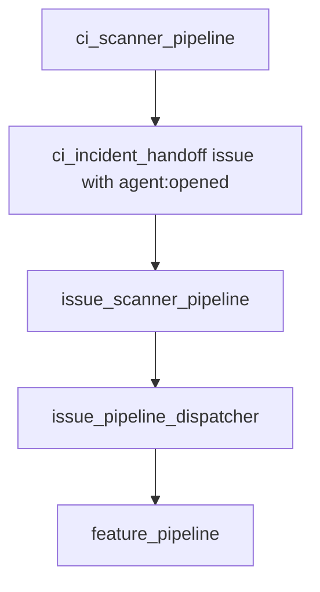
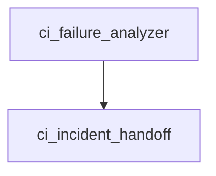
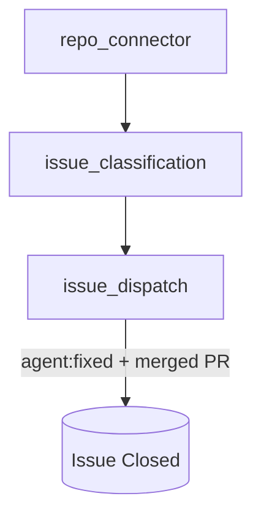
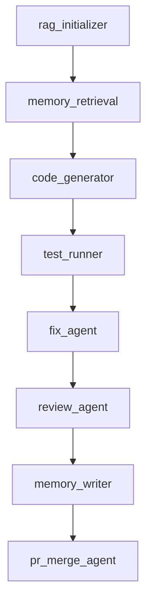

# Pipeline Graphs

```mermaid
graph TD
  A[ci_scanner_pipeline] --> B[ci_incident_handoff issue with agent:opened]
  B --> C[issue_scanner_pipeline]
  C --> D[issue_pipeline_dispatcher]
  D --> E[feature_pipeline]
```

## ci_scanner_pipeline

```mermaid
graph TD
  ci_failure_analyzer --> ci_incident_handoff
```

## issue_scanner_pipeline

```mermaid
graph TD
  repo_connector --> issue_classification
  issue_classification --> issue_dispatch
  issue_dispatch -->|agent:fixed + merged PR| issue_closed[(Issue Closed)]
```

## feature_pipeline

```mermaid
graph TD
  rag_initializer --> memory_retrieval
  memory_retrieval --> code_generator
  code_generator --> test_runner
  test_runner --> fix_agent
  fix_agent --> review_agent
  review_agent --> memory_writer
  memory_writer --> pr_merge_agent
```
